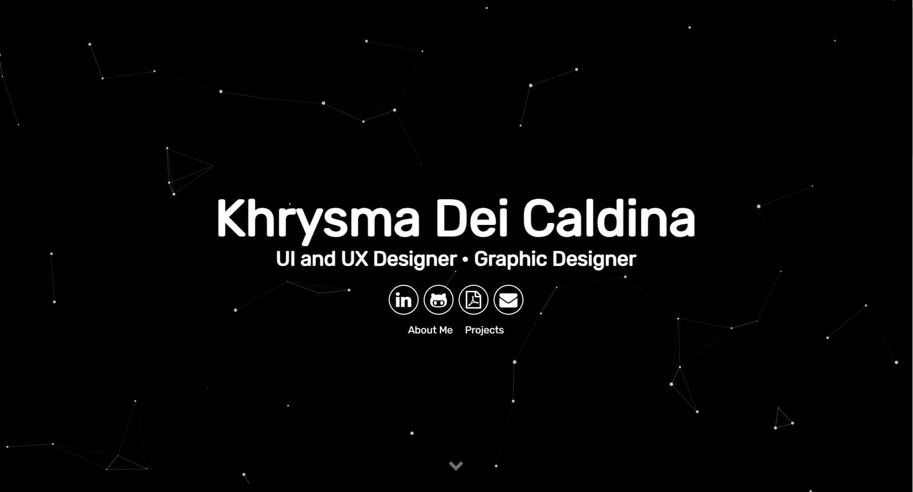

# Welcome to my Personal Website

https://www.linkedin.com/in/khrysma-dei-caldina-7b4456235/)

 I customized an existing free template, I utilized Particle.js for my UI and this website serves as my online portfolio that showcases my computing skills, featured projects, and resume.

To deploy my website online I used netlify.com

Connect with me 📩 kd.caldina@gmail.com 📩
